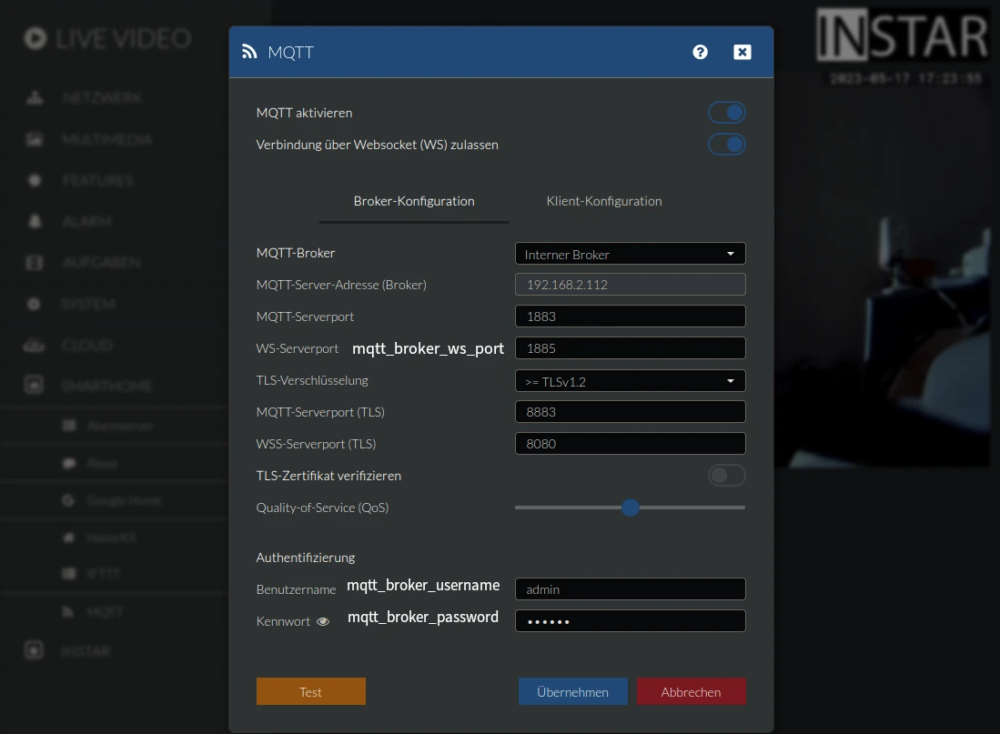
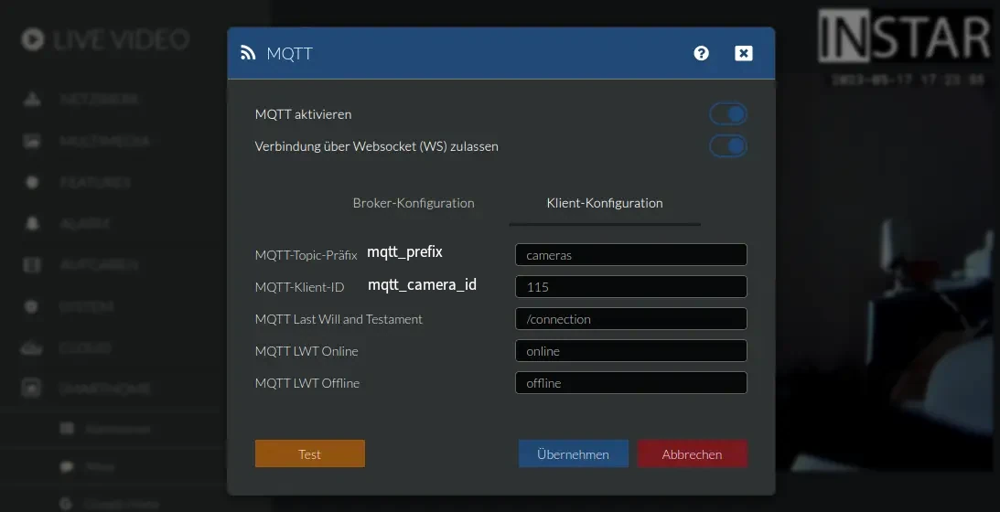
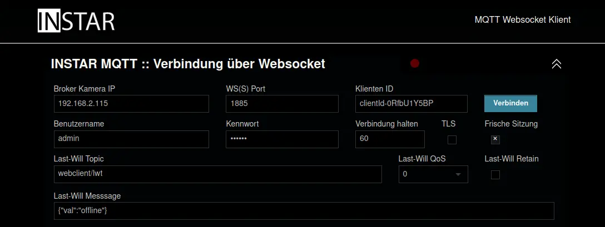
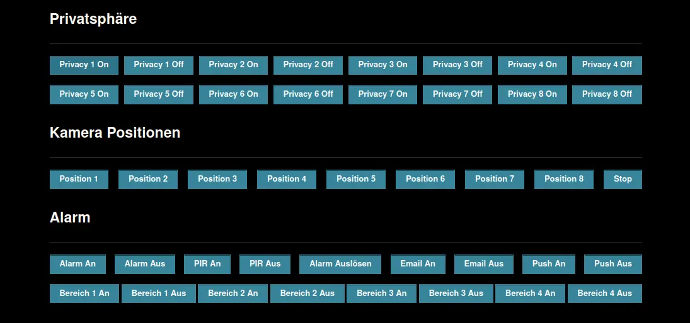
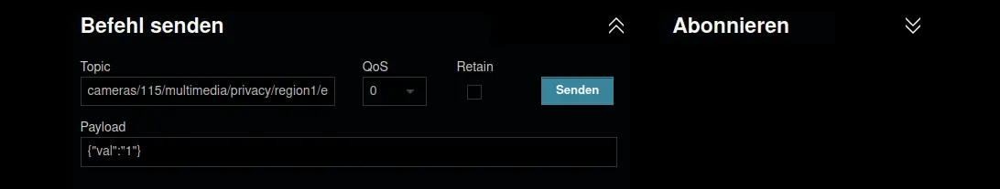
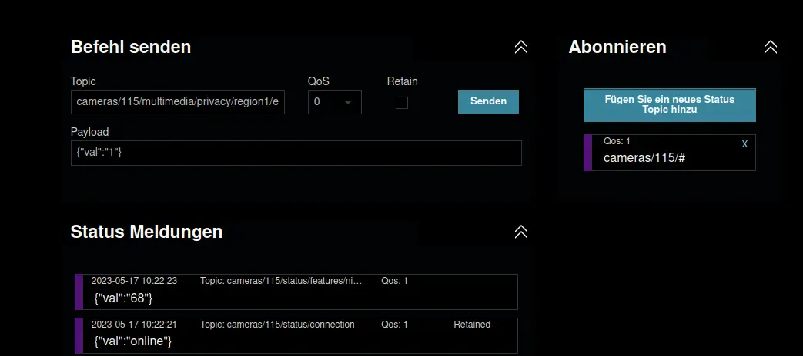

# Websocket-based MQTT Client INSTAR MQTT Camera

Use [the MQTTv5 API](https://wiki.instar.com/en/Advanced_User/INSTAR_MQTT_Broker/MQTTv5_API/) to control your INSTAR 2k+ WQHD (or higher) IP camera from an browser-native HTML webpage. This repository is a clone of the [HiveMQ MQTT Webclient](https://github.com/hivemq/hivemq-mqtt-web-client) and uses [MQTT.js](https://github.com/mqttjs/MQTT.js) to help you connect to your camera's MQTT broker.


> __Check Out__: How to use the MQTTv5 Websocket API to control your INSTAR MQTT camera through an [Elgato Streamdeck](https://wiki.instar.com/en/Software/Other_Platforms/biOs_MQTT_Stream_Deck/)


## How to use it

Put this repository into your web server's web root and open the `index.html` file inside your web browser - that's it.


## Configuration

To make using this client more convenient you can pre-configure the client with the `./config.js` file. Here you can add your broker configuration, e.g.:


```js
mqtt_broker = '192.168.2.115' // IP address of your INSTAR camera
mqtt_broker_ws_port = '1885' // Websocket MQTT server port your camera uses
mqtt_broker_username = 'admin' // MQTT broker login
mqtt_broker_password = 'instar' // MQTT broker login
mqtt_lwt = 'webclient/lwt' // last-will-topic for the web-client
mqtt_lwt_msg = '{"val":"offline"}' // last-will-topic message payload for the web-client
mqtt_prefix = 'cameras/' // MQTT prefix you configured for the camera MQTT client
mqtt_camera_id = '115/' // MQTT client ID you configured for the camera MQTT client
mqtt_qos = 1 // Default Quality-of-Service setting for the web-client
mqtt_retain = false // Default message retention setting for the web-client
mqtt_sub_topic = mqtt_prefix + '#' // default MQTT topic subscription for the web-client
mqtt_pub_topic = mqtt_prefix + mqtt_camera_id +'multimedia/privacy/region1/enable' // default MQTT publish topic for the web-client
mqtt_pub_payload = '{"val":"1"}' // default MQTT publish topic message payload for the web-client
```


The broker configuration here as the MQTT prefix and camera ID has to match your camera's MQTT configuration:








## Start the Web Client

The web client should now be pre-configured and ready to use. Click on `Verbinden` to connect to your camera broker:





The configuration file `./config.js` already sets up a couple of buttons that you can try to see if you are able to reach and control your camera. Click to activate an privacy area and see it show up in your camera's live video:





Feel free to replace any of the pre-configured commands with commands from the [MQTTv5 API](https://wiki.instar.com/en/Advanced_User/INSTAR_MQTT_Broker/MQTTv5_API/). Use the `Befehl senden` area to quickly try out any command before creating a button for it in the `./index.html` file:





You can also add a MQTT Topic wildcard subscription to listen in to all commands that your camera is receiving/sending:





# License

HiveMQ MQTT Web Client is licensed under the `APACHE LICENSE, VERSION 2.0`. A copy of the license can be found [here](LICENSE).

